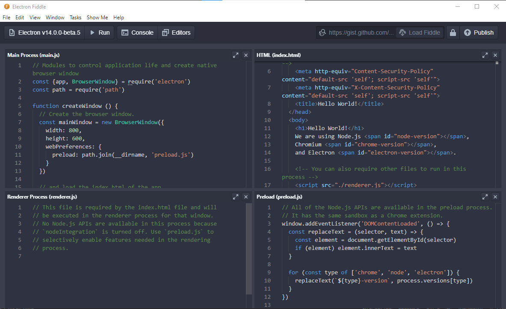
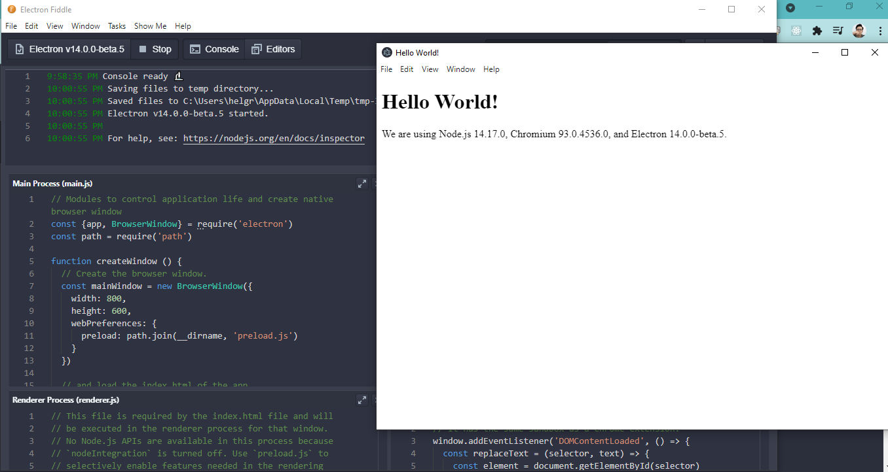

# Electronic JS - Xây dựng cross-platform desktop apps bằng JavaScript, HTML, and CSS 🙄

> Electron là Framwork (open source bởi Github) cho phép viết desktop app chạy trên mọi nền tảng (Mac, Window, Linux) dựa trên công nghệ web (Nodejs, HTML và CSS).


- [Electronic JS - Xây dựng cross-platform desktop apps bằng JavaScript, HTML, and CSS 🙄](#electronic-js---xây-dựng-cross-platform-desktop-apps-bằng-javascript-html-and-css-)
  - [Yêu cầu](#yêu-cầu)
  - [Bắt đầu nhanh với Electron Fiddle](#bắt-đầu-nhanh-với-electron-fiddle)
    - [Tạo project bằng Electron Fiddle](#tạo-project-bằng-electron-fiddle)
    - [Cấu trúc thư mục](#cấu-trúc-thư-mục)
    - [Run project bằng fiddle](#run-project-bằng-fiddle)
  - [Bắt đầu dự án thủ công](#bắt-đầu-dự-án-thủ-công)
- [Cấu hình dự án Reactjs - Electron](#cấu-hình-dự-án-reactjs---electron)
  - [Tạo dự án React bằng `create-react-app`](#tạo-dự-án-react-bằng-create-react-app)
  - [Cài Electron vào dự án React](#cài-electron-vào-dự-án-react)
  - [Chỉnh sửa file `package.json`](#chỉnh-sửa-file-packagejson)
  - [Khởi chạy](#khởi-chạy)
- [Build Electron](#build-electron)

<div style="page-break-after: always;"></div>

## Yêu cầu

-   Môi trường:
    -   [Nodejs](https://nodejs.org/en/)
-   Editor: VSCode ...
-   Có kiến thức cơ bản về HTML/CSS hoặc ReactJS

## Bắt đầu nhanh với Electron Fiddle

Electron Fiddle tạo sẵn 1 project Electron. Có thể chạy app ngay trực tiếp mà không phải cấu hình nhiều. Nó còn có tính năng chia sẽ thông qua GitHub Gist.

[Download ⯆](https://www.electronjs.org/fiddle)

### Tạo project bằng Electron Fiddle



### Cấu trúc thư mục

```
Main Process (main.js)
HTML(index.html)
Renderer Process(renderer.js)
```

<div style="page-break-after: always;"></div>

### Run project bằng fiddle



## Bắt đầu dự án thủ công

[Electron Quick Start](https://www.electronjs.org/docs/tutorial/quick-start)

<div style="page-break-after: always;"></div>

# Cấu hình dự án Reactjs - Electron

## Tạo dự án React bằng `create-react-app`

Vanilla js

```
npx create-react-app ulife-electron
```

Hoặc typescript

```
npx create-react-app --template typescript ulife-electron
```

## Cài Electron vào dự án React

```
cd ulife-electron
yarn add electron electron-is-dev --dev
```

`electron-is-dev` kiểm tra khi nào dự án đang trong quá trình dev hay production

<div style="page-break-after: always;"></div>

Tạo `/public/electron.js` và paste code vào

```
const path = require('path');

const { app, BrowserWindow } = require('electron');
const isDev = require('electron-is-dev');

function createWindow() {
  const win = new BrowserWindow({
    width: 800,
    height: 600,
    webPreferences: {
      nodeIntegration: true,
    },
  });

  win.loadURL(
    isDev
      ? 'http://localhost:3000'
      : `file://${path.join(__dirname, '../build/index.html')}`
  );
  // Open the DevTools.
  if (isDev) {
    win.webContents.openDevTools({ mode: 'right' });
  }
}

app.whenReady().then(createWindow);

app.on('window-all-closed', () => {
  if (process.platform !== 'darwin') {
    app.quit();
  }
});

app.on('activate', () => {
  if (BrowserWindow.getAllWindows().length === 0) {
    createWindow();
  }
});
```

<div style="page-break-after: always;"></div>

## Chỉnh sửa file `package.json`

Trong file `package.json` thêm:

```
{
  ...
  "main": "public/electron.js",
  ...
}
```

Cài packages `concurrently`, `wait-on`

```
yarn add concurrently wait-on --dev
```

Thêm `scripts` vào `package.json`

```
"scripts": {
    ...
    "dev": "concurrently -k \"BROWSER=none npm start\" \"npm:electron\"",
    "electron": "wait-on tcp:3000 && electron ."
}
```

-   `concurrently`: cho phép chạy nhiều lệnh trong 1 script
-   `wait-on`: cho phép port 3000 trong CRA là mặc định

<div style="page-break-after: always;"></div>

File `package.json` sẽ trông như thế này

```
{
  "name": "ulife-electron",
  "version": "0.1.0",
  "private": true,
  "main": "public/electron.js",
  "dependencies": {
    ...
  },
  "scripts": {
    "start": "react-scripts start",
    "build": "react-scripts build",
    "test": "react-scripts test",
    "eject": "react-scripts eject",
    "dev": "concurrently -k \"BROWSER=none npm start\" \"npm:electron\"",
    "electron": "wait-on tcp:3000 && electron ."
  },
  "devDependencies": {
    "concurrently": "^6.2.0",
    "electron": "^13.1.6",
    "electron-is-dev": "^2.0.0",
    "wait-on": "^6.0.0"
  }
}

```

<div style="page-break-after: always;"></div>
## Khởi chạy

```
yarn dev
```

Hoặc

```
npm run dev
```

Hoàn thành cấu hình Electron với ReactJS, việc còn lại là code dự án bằng ReactJs thôi. 👏👏👏

<div style="page-break-after: always;"></div>

# Build Electron

Cài đặt electron-builder

```
yarn add --dev electron-builder
```

Thêm script trong package.json

```
"script": {
  ...
  "pack": "electron-builder --dir",
  "dist": "electron-builder"
}

```

Cài đặt lại react-scripts trong môi trường Dev

```
yarn remove react-scripts
yarn add --dev react-scripts
```

Build

```
yarn dist
```

<div style="page-break-after: always;"></div>

Tài liệu tham khảo

-   [Electron Document](https://www.electronjs.org/docs)
-   [Building an Electron application with create-react-app - freecodecamp.org](https://www.freecodecamp.org/news/building-an-electron-application-with-create-react-app-97945861647c/)
-   [Getting Started with Electron by Creating a React App](https://www.section.io/engineering-education/desktop-application-with-react/)
